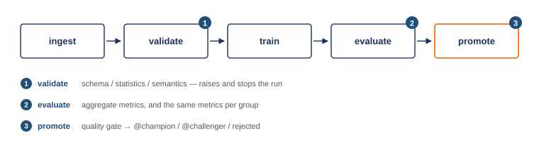

# Lab 2 — ML Pipeline & Experiment Tracking

DDM501 · AI in DevOps, DataOps, MLOps · FSB

Lab 1 produced one model from one script. That does not survive contact with a
real team: nobody can say which data produced it, which hyperparameters won, or
why this version rather than the last one. This lab turns that script into a
pipeline whose every run is recorded, comparable, and — when it earns it —
promoted automatically.

Same credit default problem as Lab 1. Same data. The question changes from
*does it serve?* to *can you reproduce it, compare it, and decide about it?*

All TODOs are complete. The team report — pipeline design, experiment
analysis, the promotion decision, orchestration and reproducibility — is in
[`docs/REPORT.md`](docs/REPORT.md) (PDF: `docs/REPORT.pdf`).

---

## What was built, and by whom

| File | Task | Owner | What it is |
|---|---|---|---|
| `pipeline/validation.py` | 1 | Ducmanh2212 | The three-level data quality gate |
| `pipeline/preprocessing.py` | 2 | Ducmanh2212 | Derived features and the ColumnTransformer |
| `pipeline/training.py` | 3 | hieunt-fsb-ai | MLflow tracking around the fit, training-data fingerprint |
| `pipeline/evaluation.py` | 4 | hieunt-fsb-ai | Metrics, per-group metrics, fairness gap |
| `pipeline/registry.py` | 5 | thientd2609 | Best run, register, alias, quality gate, promotion |
| `experiments/` | 6 | thientd2609 | Sweep, leaderboard, `--promote-best`, bootstrap analysis |
| `dags/credit_training_dag.py` | 7 | maxnguyen83 | Five task bodies and the dependency graph |
| `docker/airflow.Dockerfile`, `docker-compose.yml` | 8 | maxnguyen83 | The Airflow image and the MLflow service |
| `tests/` | — | each owner | One test module per stage (see Tests) |

**Definition of done: `.github/workflows/smoke.yml`.** It runs the tests, runs
the pipeline, asserts a model reached `@champion`, runs the sweep, then installs
Airflow and parses the DAG. Both jobs were replayed step by step on Python 3.11
and pass (71 tests, 99% coverage of `pipeline/`).

### Results in one table

| Run | ROC AUC | PR AUC | Fairness gap | Registry |
|---|---|---|---|---|
| logreg-01 (best AUC) | 0.7511 | 0.5534 | 0.0558 | v2 **rejected** — gap over 0.05 |
| hgb default (CLI) | 0.7473 | 0.5444 | 0.0306 | v1 **@champion** |
| hgb default (weekly DAG) | 0.7473 | 0.5444 | 0.0306 | v3 **@challenger** — ties v1, no 0.002 gain |

The AUC differences between all seven sweep runs are inside the bootstrap
noise; logistic regression's wider fairness gap is not. The reasoning is in
the report, section 3.

| Evidence | File |
|---|---|
| Airflow graph, promote branch | `docs/screenshots/airflow-graph-promote.png` |
| Airflow graph, skip branch | `docs/screenshots/airflow-graph-skip.png` |
| MLflow runs | `docs/screenshots/mlflow-runs.png`, `docs/screenshots/mlflow-compare-sweep.png` |
| MLflow registry (aliases + gate tags) | `docs/screenshots/mlflow-registry.png` |
| Logged artifacts of the champion run | `docs/screenshots/mlflow-champion-artifacts.png` |

---

## The pipeline



Each stage is a module in `pipeline/`. The CLI, the tests and the Airflow DAG
all call the same functions — the DAG orchestrates, it never reimplements.

---

## Quick start

Tested on Python 3.11 (CI) and 3.12 (local).

```bash
python -m venv .venv
source .venv/bin/activate          # Windows: .venv\Scripts\activate
pip install -r requirements.txt

# Runs against a local file store at ./mlruns — no server needed
python -m pipeline.run_pipeline

# Look at what it recorded
mlflow ui --backend-store-uri ./mlruns      # http://localhost:5000
```

With the tracking server instead:

```bash
docker compose up -d mlflow
export MLFLOW_TRACKING_URI=http://localhost:5000
python scripts/setup_mlflow.py             # confirms it is reachable
python -m pipeline.run_pipeline
```

Sweep the hyperparameter grid and print a leaderboard:

```bash
python -m experiments.run_experiments
python -m experiments.run_experiments --leaderboard-only --top 5

# Is the ranking real? Paired bootstrap over the test set, plus the baselines
# the gate is calibrated on (PAY_0 rule, actual default-rate gap by SEX).
python -m experiments.analyse_sweep

# Send the best run by ROC AUC through the same gate the pipeline uses.
python -m experiments.run_experiments --leaderboard-only --promote-best
```

---

## The full stack

```bash
docker compose up -d --build

# MLflow   http://localhost:5000
# Airflow  http://localhost:8080   (airflow / airflow)
```

On Linux, run `echo "AIRFLOW_UID=$(id -u)" > .env` once first so the Airflow
containers can write to `logs/` and `artifacts/`.

Unpause `credit_default_training` in the Airflow UI and trigger it. A manual
trigger can pick the model family with the run config `{"model_type": "logreg"}`;
the schedule uses `MODEL_TYPE` (default `hgb`). Seven tasks:

| Task | Does |
|---|---|
| `ingest` | Load the CSV, split it, write the split to the shared volume |
| `validate` | Schema, statistics and semantics. Raises and stops the DAG on failure |
| `train` | Fit the pipeline inside an MLflow run |
| `evaluate` | Aggregate metrics, per-group metrics, fairness gap — all logged |
| `decide` | Branch on the quality gate; tags the MLflow run `quality_gate: passed/failed` |
| `promote_model` / `skip_promotion` | Register and alias, or do nothing |
| `cleanup` | Remove the run directory down whichever branch ran |

---

## Two dependency sets, on purpose

`requirements.txt` has no Airflow in it. That is not an oversight.

Airflow pins several hundred transitive dependencies. Installing it next to
MLflow in one environment makes pip backtrack for minutes and often fails; when
it does succeed it silently downgrades things MLflow needs. So:

| File | Used by | Notes |
|---|---|---|
| `requirements.txt` | Your laptop, CI, the tests | numpy 2.2, pandas 2.2, scikit-learn 1.6 |
| `requirements-airflow.txt` | `docker/airflow.Dockerfile` only | numpy 1.24, pandas 2.1 — **pinned by Airflow's own constraints** |

The two sets disagree on numpy and pandas versions, and that is fine: they never
share an interpreter. Trying to reconcile them is how people lose an afternoon.

The Airflow image installs those packages **with Airflow's constraints file**.
Skipping the constraint is the fastest way to break a working scheduler.

---

## MLflow aliases, not stages

MLflow deprecated model registry stages (`Staging`, `Production`) in 2.9 and
will remove them. This lab uses **aliases**:

```python
client.set_registered_model_alias(name, alias="champion", version="4")
model = mlflow.sklearn.load_model("models:/credit-default-classifier@champion")
```

| | Stages (deprecated) | Aliases |
|---|---|---|
| Promotion | mutates the version's state | moves a pointer |
| History | overwritten | intact — versions are immutable |
| Count | four fixed names | as many as you need |

Two aliases are used here: `@champion` is what a serving layer would load,
`@challenger` is a candidate that passed the gate but did not beat the champion.

---

## The quality gate

`promote_model` never promotes on accuracy alone. Three checks, all must pass:

```
roc_auc      >= 0.72     # the one-feature rule "sort by PAY_0" scores 0.711
pr_auc       >= 0.48     # the same rule scores 0.446
fairness_gap <= 0.05     # actual default-rate gap by SEX is 0.031-0.039, + ~1 SE
```

and then the candidate must beat the current champion by a margin of 0.002 —
without the margin, noise triggers deployments.

These are our thresholds, not the starter's (0.70 / 0.45 / 0.10, which every
sweep candidate passed). They are calibrated on baselines, not on the
leaderboard; `python -m experiments.analyse_sweep` prints both baselines. All
three can be overridden with `MIN_ROC_AUC`, `MIN_PR_AUC` and `MAX_FAIRNESS_GAP`.

The fairness check is the interesting one. `fairness_gap` is the largest
difference in *selection rate* (the share of applicants sent to review or
decline) between demographic groups. A model can be the most accurate candidate
in the sweep and still be refused promotion here.

On our run, logistic regression posts the best ROC AUC (0.7511) **and** the
widest fairness gap (0.0558). Its AUC lead over the boosting model is inside the
bootstrap noise (95% CI of the difference [−0.0023, +0.0097]); its extra gap is
not ([+0.015, +0.035]). The gate rejects it, and we keep gradient boosting as
the champion — see the report, section 3.

---

## Project structure

```
.
├── pipeline/
│   ├── config.py           Everything configurable, all env-overridable
│   ├── data_ingestion.py   Load, stratified split, dataset stats
│   ├── validation.py       Schema / statistics / semantics gate
│   ├── preprocessing.py    Derived features + the sklearn ColumnTransformer
│   ├── training.py         Fit inside an MLflow run
│   ├── evaluation.py       Metrics, per-group metrics, fairness gap
│   ├── registry.py         Register, alias, quality gate, promotion
│   └── run_pipeline.py     CLI entry point
├── experiments/
│   ├── run_experiments.py  Grid sweep + leaderboard + --promote-best
│   └── analyse_sweep.py    Paired bootstrap: are leaderboard gaps real?
├── dags/
│   └── credit_training_dag.py
├── docker/
│   └── airflow.Dockerfile
├── data/credit_default.csv Committed — the lab needs no network
├── tests/                  One module per stage + conftest.py
├── docs/REPORT.md          Team report (and REPORT.pdf, screenshots/)
├── docker-compose.yml
├── requirements.txt
└── requirements-airflow.txt
```

---

## Tests

```bash
pytest tests/ -v --cov=pipeline --cov-report=term-missing
```

The five required classes are split one module per stage, so each stage's
tests sit with the person who owns that stage. Shared fixtures are in
`tests/conftest.py`; MLflow tests use a throwaway file store.

| Class | Module | Asserts |
|---|---|---|
| `TestDataIngestion` | `test_pipeline.py` | The split is stratified, reproducible, and leaks nothing |
| `TestValidation` | `test_validation.py` | Every category of bad data is caught and stops the run |
| `TestPreprocessing` | `test_preprocessing.py` | Derived features are correct; the transformer lives inside the Pipeline |
| `TestTraining` | `test_training.py` | Every model type builds and fits; params override defaults; the run logs what rebuilds it |
| `TestEvaluation` | `test_evaluation.py` | Metrics are in range and internally consistent; slices cover everyone |
| `TestQualityGate`, `TestRegistry` | `test_registry.py` | An accurate but unfair model is rejected; a missing metric fails closed; champion / challenger / rejected end to end |
| `TestSweep`, `TestSweepAnalysis` | `test_experiments.py` | Each config is its own run; the leaderboard is ordered; the bootstrap behaves |
| `TestDagStructure`, `TestDecide`, `TestDagRun` | `test_dag.py` | The graph, the branch ids, scalar-only XCom, cleanup down both branches |
| `TestRunPipeline` | `test_run_pipeline.py` | The CLI end to end, with and without the registry |

`test_dag.py` runs without Airflow installed (it stubs the three Airflow classes
the DAG imports); with Airflow installed the same assertions run on the real DAG.

`test_split_is_reproducible` looks trivial and is not. Without a fixed seed,
every metric comparison in MLflow measures split noise as much as model
quality — and you would never know, because the numbers still look plausible.

---

## Troubleshooting

**`Experiment 'credit-default-risk' not found`**
Nothing has been logged yet. Run the pipeline once, or `python scripts/setup_mlflow.py`.

**`Cannot reach the tracking server`**
`MLFLOW_TRACKING_URI` points at a server that is not running. Either
`docker compose up -d mlflow`, or unset the variable to fall back to `./mlruns`.

**Airflow UI shows the DAG as broken, with an import error**
The image does not have the pipeline's dependencies. Rebuild it:
`docker compose build airflow-scheduler`. Do not `pip install` inside a running
container — the change disappears on the next restart.

**`pip install` takes forever or fails after you added Airflow to requirements.txt**
Take it back out. See "Two dependency sets" above.

**`transition_model_version_stage is deprecated`**
You are using the old stage API. Use `set_registered_model_alias` instead.

**Every test passes before you have written anything**
A stub whose body is `pass` returns `None`, and pytest counts that as a pass.
Delete the `pass` as you implement each test.

**`airflow dags list` shows the DAG but the graph in the UI is a flat row**
The dependencies are not wired — see block 6 at the bottom of the DAG file.

**Every experiment run gets the same metrics**
Check that you are passing the sweep's parameters into `train_model`. It is easy
to build the config dict and never use it — the runs then differ only by name.

**`cannot import name 'FallbackAsyncAdaptedQueuePool'`**
SQLAlchemy 2.1 with MLflow 2.19 — any `sqlite:///` or `postgresql://` store
fails. `requirements.txt` pins `SQLAlchemy==2.0.36`; reinstall from it.

**`OSError: [Errno 30] Read-only file system: '/mlflow'` when logging to the server**
The server was started with a plain `--default-artifact-root /mlflow/artifacts`,
which makes every client write to its own `/mlflow`. Our compose file proxies
artifacts through the server instead (`--serve-artifacts`,
`--artifacts-destination /mlflow/artifacts`). An experiment created under the
old setting keeps its old artifact location: `docker compose down -v` and start
again.

**Tasks stay "running" at 100% CPU when Airflow runs natively on macOS**
`setproctitle` hangs inside the forked task process on recent macOS versions
(seen with 1.3.3 and 1.3.8). The Linux image is not affected — run the DAG
through `docker compose`, not a local Airflow install.

**The DAG runs but nothing appears in MLflow**
Inside the compose network the tracking server is `http://mlflow:5000`, not
`http://localhost:5000`. `localhost` inside a container is that container.
