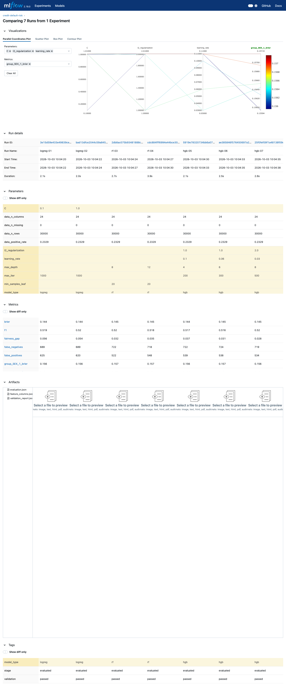
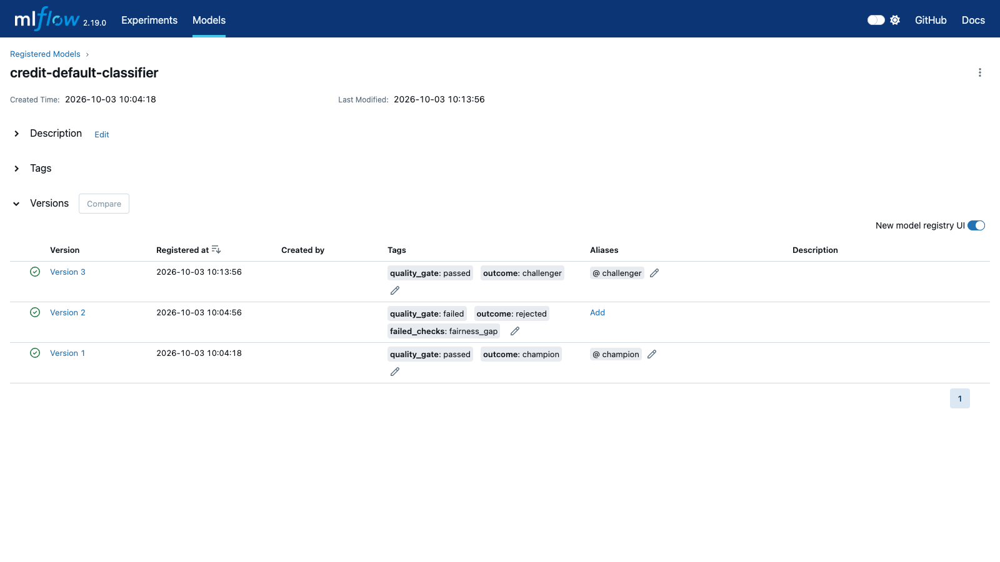
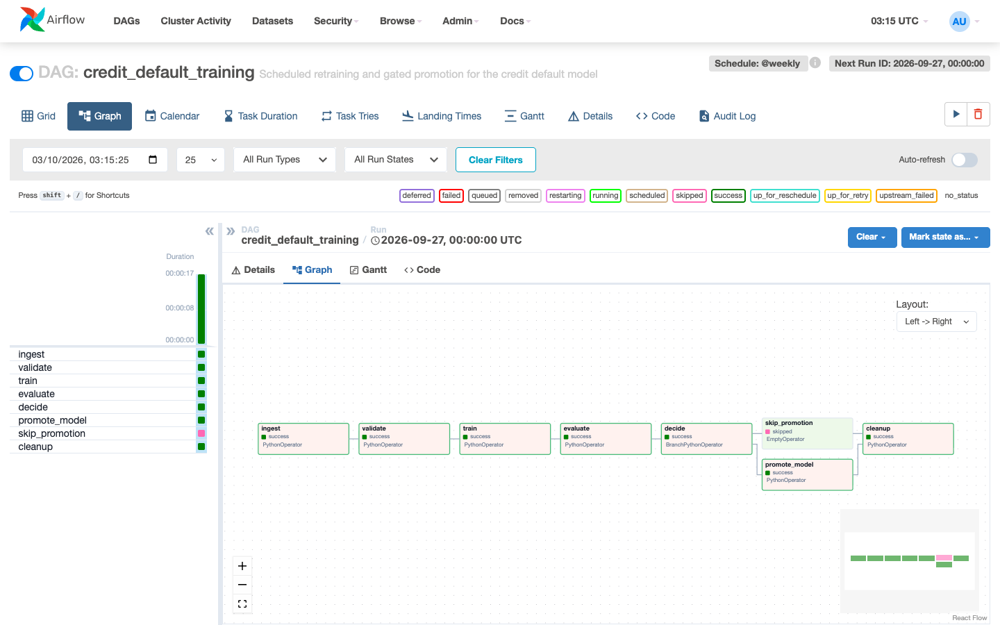
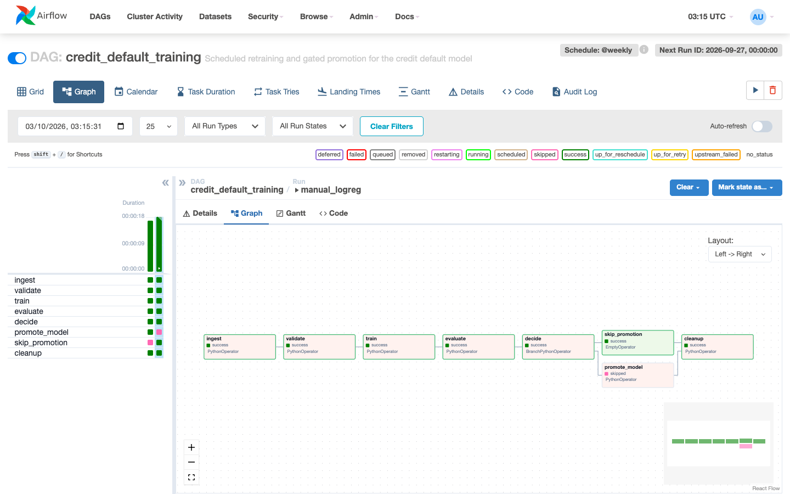

**Team:** maxnguyen83 (pipeline design, orchestration, reproducibility, stack), Ducmanh2212 (validation, features), hieunt-fsb-ai (training, evaluation), thientd2609 (registry, sweep, experiment analysis, promotion decision).

All numbers below come from our own runs on the committed dataset (30,000 rows, seed 501, 24,000 / 6,000 stratified split). The commands that regenerate them are in section 5.

---

## 1. Pipeline design

```
ingest -> validate -> train -> evaluate -> promote
```

| Stage | Module | Owns | Output | Fails how |
|---|---|---|---|---|
| Ingest | `data_ingestion.py` | Reading the CSV, the seeded stratified split, the data summary | `X_train/X_test/y_train/y_test`, `dataset_stats` | `FileNotFoundError` |
| Validate | `validation.py` | The decision "is this data fit to train on?" — schema, statistics, semantics | A report dict covering all three levels | `DataValidationError` listing every problem at once |
| Train | `preprocessing.py`, `training.py` | Six derived features, the unfitted `ColumnTransformer`, the estimator, the MLflow run | Fitted `Pipeline` + run id | Exceptions from sklearn / MLflow |
| Evaluate | `evaluation.py` | Metrics at the 0.30 review threshold, the same metrics per `SEX` group, the fairness gap | Metrics logged to the *same* run | — |
| Promote | `registry.py` | The quality gate, registration, the alias | `champion` / `challenger` / `rejected` | A failed gate is an outcome, not an error |

The CLI (`pipeline/run_pipeline.py`), the sweep (`experiments/run_experiments.py`), the Airflow DAG and the tests all call these same functions. Nothing is re-implemented in the DAG, so the model the schedule produces is the model the tests exercised.

**Why validation sits in front of training, as its own stage, rather than inside ingestion.**

1. *Different failure, different owner.* An ingestion failure is an I/O problem (file missing, wrong path); a validation failure is a data-quality problem that someone upstream has to fix. As a separate stage — and a separate Airflow task — a red `validate` box says which one it is, and the ingested data stays on the volume for inspection.
2. *The cheapest place to stop.* Validation takes 0.6–0.7 s in our DAG runs; training takes 4–5 s here and far longer on real data or bigger models. Bad data should be stopped before the expensive step, not discovered after it.
3. *Some failures do not fail training at all.* A target column that is all zeros trains "successfully" into a model that predicts "no default" for everybody. `test_degenerate_target_is_caught` shows the statistics level refusing that frame. A check *after* training would be too late: the model would already exist.
4. *The report must travel with the model.* The validation report is an input of the training run (`validation_report.json` artifact, `validation` tag). Running it immediately before training, on the same frame, means the evidence describes exactly the rows that were trained on. In the DAG, `validate` reads `raw.parquet` and `train` reads `split.joblib`, both written by `ingest` from one in-memory frame.

Each level returns a list of strings instead of raising, and `validate_dataset` raises once with all of them. `test_report_is_returned_when_not_raising` breaks all three levels at once (missing `AGE`, `SEX = 7`, all-zero target) and gets three non-empty lists back: one run shows every problem instead of one problem per run.

**Other design decisions, and the alternative we rejected**

| Decision | Alternative | Why we chose it |
|---|---|---|
| Preprocessing lives inside the sklearn `Pipeline`; `build_preprocessor` returns it unfitted | Fit a scaler once and save it next to the model | Scaling and encoding are fitted on the training fold only and pickled with the model, so serving cannot drift from training. A test asserts the transformer comes back unfitted. |
| Zero `LIMIT_BAL` / `BILL_AMT1` become `NaN` before dividing | Divide, then clip `inf` to 5 | 2,740 rows have `BILL_AMT1 = 0`. `NaN` is an honest "not applicable" that the median imputer handles; `inf` breaks `StandardScaler` without raising. |
| `OneHotEncoder(handle_unknown="ignore")` | Default (`error`) | An unseen `EDUCATION = 99` still gets an answer instead of an exception; tested. |
| Gate reads metrics with fail-closed defaults (`0.0` for the AUCs, `inf` for the gap) | `.get(key, 0)` everywhere | A missing gap would read as 0 and pass the fairness check. `passes_quality_gate({})` fails all three checks. |
| Rejected models are registered and tagged | Register only what passes | Version 2 in our registry (`quality_gate: failed`, `failed_checks: fairness_gap`) shows the gate caught a model, not that it was never trained. |

One limitation we left in place: `run_pipeline.py` reads the CSV twice (once to validate, once inside `load_and_split`). If the file changed between the two reads, the validated rows and the trained rows could differ. The DAG reads once in `ingest`, and the training-data fingerprint (section 5) would expose the mismatch.

---

## 2. Experiment analysis

The sweep `python -m experiments.run_experiments` trains seven configurations from three families. Every run uses the same split, the same features and the same evaluation.

**Leaderboard** (sorted by ROC AUC; recall, precision and selection rates at the 0.30 review threshold; *sel* = share of the group sent to review):

| Run | Config | ROC AUC | PR AUC | Recall | Precision | Brier | Gap | sel SEX=1 | sel SEX=2 |
|---|---|---|---|---|---|---|---|---|---|
| logreg-01 | C=0.1 | **0.7511** | **0.5534** | 0.5068 | 0.5311 | 0.1440 | **0.0558** | 0.2560 | 0.2002 |
| logreg-02 | C=1.0 | **0.7511** | **0.5534** | 0.5068 | 0.5331 | 0.1440 | 0.0544 | 0.2543 | 0.1999 |
| rf-04 | 300 trees, depth 12 | 0.7502 | 0.5405 | 0.4860 | 0.5534 | 0.1450 | 0.0353 | 0.2259 | 0.1906 |
| hgb-05 | 200 it, lr 0.10, depth 4 | 0.7486 | 0.5468 | 0.4832 | 0.5560 | 0.1444 | 0.0368 | 0.2247 | 0.1879 |
| rf-03 | 200 trees, depth 8 | 0.7482 | 0.5393 | 0.4832 | 0.5639 | 0.1452 | 0.0324 | 0.2192 | 0.1868 |
| hgb-07 | 500 it, lr 0.03, depth 8 | 0.7475 | 0.5435 | 0.4853 | 0.5594 | 0.1449 | **0.0276** | 0.2187 | 0.1912 |
| hgb-06 | 300 it, lr 0.06, depth 6 (default) | 0.7473 | 0.5444 | 0.4817 | 0.5557 | 0.1448 | 0.0306 | 0.2204 | 0.1898 |

What the sweep actually told us:

1. **Hyperparameters barely matter; the features do.** All seven runs fall within 0.0038 ROC AUC of each other. Inside a family the spread is smaller still: `C = 0.1` and `C = 1.0` give the same AUC to four decimals, and the three boosting configurations span 0.0013. The one-feature rule "sort by `PAY_0`" already scores 0.711 ROC AUC / 0.446 PR AUC on the same test set, so the models add about 0.04 AUC over a rule an analyst could apply by hand.

2. **The AUC ranking is inside the noise.** `python -m experiments.analyse_sweep` reloads every logged model from MLflow and runs a paired bootstrap (1,000 resamples of the 6,000 test rows, every model scored on the same resample). Each model's own 95% interval is about ±0.015 (logreg-01: [0.736, 0.766]). Against the default boosting run hgb-06:

   | Run | ΔAUC vs hgb-06 (95% CI) | Δgap vs hgb-06 (95% CI) |
   |---|---|---|
   | logreg-01 | +0.0038 [−0.0023, +0.0097] | **+0.0252 [+0.0153, +0.0348]** |
   | rf-04 | +0.0029 [−0.0018, +0.0075] | +0.0047 [−0.0031, +0.0127] |
   | hgb-05 | +0.0013 [−0.0018, +0.0044] | +0.0062 [−0.0005, +0.0129] |
   | hgb-07 | +0.0002 [−0.0022, +0.0026] | −0.0030 [−0.0073, +0.0015] |

   Every AUC interval contains zero. The only difference that is clearly not noise is logistic regression's wider fairness gap. **The accuracy advantage is noise; the fairness disadvantage is not.**

3. **Where the gap comes from.** The actual default rate differs between the groups: 25.65% for `SEX = 1` and 21.75% for `SEX = 2` on the test set (gap 0.039; 0.031 on the training set). Every tree model's selection-rate gap (0.028–0.037) sits at or below that outcome gap, so it reflects the difference in outcomes. Logistic regression's gap (0.054–0.056) is about 40% larger than the outcome gap, so it amplifies it. The coefficients show the mechanism: the linear model applies a fixed log-odds shift for `SEX` to every applicant (one-hot coefficients −0.270 and −0.376, the 5th and 2nd largest of 35 by magnitude). The equal-opportunity view agrees: recall for `SEX = 1` vs `SEX = 2` is 0.524 vs 0.494 for logreg-01, and 0.484 vs 0.480 for hgb-06.

4. **Recall at a fixed threshold is not a fair comparison across families.** Logistic regression has the highest recall (0.507) partly because it sends more people to review at 0.30 (22.2% of applicants, vs 20.2% for hgb-06), at lower precision (0.531 vs 0.556). That is a calibration difference, not better ranking; ROC and PR AUC are the like-for-like numbers.

5. **Cost is not tied.** Measured from the logged artifacts: rf-04's `model.pkl` is 17.8 MB with 15.6 ms single-row latency; hgb-06 is 0.24 MB / 2.3 ms; logistic regression is under 0.01 MB / 0.9 ms. rf-04 buys +0.0029 AUC (inside the noise) for 74× the size and 7× the latency.

6. **The numbers are stable.** We ran the full sweep twice, once against the MLflow server and once against the local file store, and got identical metrics to four decimals.

{width=85%}

---

## 3. The promotion decision

**We promote the gradient-boosting model with the default configuration (hgb-06, registered as v1 with alias `@champion`).** We do not promote logistic regression, and we do not promote rf-04.

Why:

- **Logistic regression is not more accurate in any way we can show** (ΔAUC CI [−0.0023, +0.0097]), and it is reliably less fair (Δgap CI [+0.015, +0.035]): its selection-rate gap is larger than the gap in actual outcomes. Paying a measurable fairness cost for an accuracy gain we cannot tell apart from zero is a bad trade.
- **rf-04's gain is also inside the noise**, its PR AUC is lower (0.5405 vs 0.5444), and it is 74× larger and 7× slower to serve.
- **hgb-07 ties hgb-06 on everything** (Δgap −0.003, CI includes zero) with a bigger model.
- **hgb-06 is the configuration the CLI and the weekly DAG train.** The champion and every scheduled challenger are then the same recipe on newer data, so the champion comparison measures the data and not a change of model family.

**What we do about the accuracy-vs-fairness trade-off.** We do not rank first and look at fairness afterwards. Fairness is a hard constraint in the gate, and accuracy ranks only the candidates that clear it. That is enforced in the registry, not only argued here: `python -m experiments.run_experiments --leaderboard-only --promote-best` takes the top run by ROC AUC (logreg-01) through `promote_model`, and the gate rejects it:

```
best by roc_auc: run 3e15d59e433e (logreg, roc_auc=0.7511)
registry: credit-default-classifier v2 -> rejected
gate failed: {"fairness_gap": {"passed": false, "value": 0.0558..., "rule": "fairness_gap <= 0.05"}}
```

Version 2 stays in the registry tagged `quality_gate: failed` and `failed_checks: fairness_gap`, with no alias. We did not try "fairness through unawareness" (dropping `SEX`). `LIMIT_BAL` and the repayment history are correlated with it, so we would have to measure the gap again rather than assume it closes. That is our next experiment.

**The gate thresholds we chose, and why.** Every one of the seven candidates passes the starter's thresholds (0.70 / 0.45 / 0.10), so as a decision rule they decide nothing. We calibrated ours against baselines rather than against the leaderboard (`pipeline/config.py`; all three can still be overridden by environment variable):

| Check | Starter | Ours | Basis |
|---|---|---|---|
| `roc_auc >=` | 0.70 | **0.72** | The `PAY_0` rule alone scores 0.711, so at 0.70 the gate would pass a model worse than sorting by one column. Our models score 0.747–0.751 (lower 95% bound ≈ 0.732), which leaves a normal retrain some headroom. |
| `pr_auc >=` | 0.45 | **0.48** | The `PAY_0` rule scores 0.446 (no-skill = base rate 0.233). Same logic: beat the rule by a visible margin. |
| `fairness_gap <=` | 0.10 | **0.05** | The actual default-rate gap between groups is 0.031 (train) / 0.039 (test), and the bootstrap standard error of a gap estimate is about 0.011. A model may reflect the outcome gap plus noise, but not exceed it: 0.031–0.039 + ~0.011 ≈ 0.05. |
| champion margin | 0.002 | 0.002 (kept) | See below. |

Two honest caveats. First, the gate tests a point estimate. Logreg's gap interval [0.035, 0.079] straddles 0.05, and the trees' upper bounds reach 0.05–0.059, so a future retrain close to the line could fall either side. That is why a passing model that does not beat the champion becomes `@challenger` and waits instead of shipping. Second, the 0.002 champion margin is smaller than the standard error of a paired AUC difference here (0.0012–0.003). Had we submitted rf-04, it would have become champion on a +0.0029 difference the bootstrap cannot separate from zero. We recommend raising the margin to about two standard errors (≈ 0.005) before trusting it to decide deployments on its own. We kept the brief's 0.002 in the code and made this call by hand.

**Registry state after all runs:**

| Version | Source run | Outcome | Alias | Tags |
|---|---|---|---|---|
| v1 | `pipeline-hgb` (hgb-06 config, CLI) | champion | `@champion` | `quality_gate: passed` |
| v2 | `logreg-01` (sweep, `--promote-best`) | rejected | — | `quality_gate: failed`, `failed_checks: fairness_gap` |
| v3 | `airflow-2026-09-20` (scheduled DAG run, hgb) | challenger | `@challenger` | `quality_gate: passed`; ties v1 at 0.7473, so it does not beat it by the margin |

{width=85%}

---

## 4. Orchestration

```
ingest -> validate -> train -> evaluate -> decide -> [promote_model | skip_promotion] -> cleanup
```

Every task body is a thin wrapper: it pulls what it needs from XCom, calls one `pipeline` function, writes data to the run directory and pushes metadata. `train` reads the model family from `dag_run.conf["model_type"]` on a manual trigger and falls back to `MODEL_TYPE` (default `hgb`) on the schedule.

**What travels through XCom, and what does not.** XCom values are serialised into Airflow's metadata database, so we push only small JSON: paths, ids, scalars and short reports. Measured on the scheduled run:

| XCom key | Producer | Size | Content |
|---|---|---|---|
| `run_dir` | ingest | ~150 B | Path of this run's directory on the shared volume |
| `data_stats` | ingest | 75 B | rows, columns, positive rate, missing count |
| `validation_report` | validate | 135 B | passed flag and the three error lists (empty here) |
| `mlflow_run_id` | train | 32 B | The MLflow run every later task logs into |
| `metrics` | evaluate | 330 B | Scalar metrics only (roc_auc, pr_auc, …, fairness_gap) |
| `quality_gate` | decide | 314 B | Gate verdict with per-check detail |
| `promotion` | promote_model | 805 B | Version, outcome, gate result, metrics |

What does **not** go through XCom lives in the run directory on the shared volume (`PIPELINE_RUN_DIR`): `raw.parquet` (2.0 MB), `split.joblib` (6.7 MB), `model.joblib` (0.24 MB for hgb), `validation_report.json`, and the full `evaluation.json` with per-group metrics. A DataFrame is neither small nor JSON; pushing the 6.7 MB split would copy it into the metadata database on every run. The nested per-group metrics stay on the volume and in MLflow, because the gate only needs the scalars. `tests/test_dag.py` enforces this with a fake TaskInstance whose `xcom_push` rejects anything that is not JSON-serialisable or is larger than 48 KB, and asserts that `metrics` contains no `group_metrics`.

**The branch.** `decide` is a `BranchPythonOperator` and returns the literal task id `"promote_model"` or `"skip_promotion"`; a test checks that the returned id is one of `decide`'s downstream task ids. `cleanup` keeps `trigger_rule="none_failed_min_one_success"`: one branch is always skipped, and under the default `all_success` cleanup would be skipped too and leave ~9 MB behind per run. In both runs below, `cleanup` succeeded and the run directory was gone afterwards.

**Audit trail on the skip branch.** `skip_promotion` never touches the registry, so `decide` also writes `quality_gate: passed|failed` as a tag on the MLflow run. The logreg run below carries `quality_gate: failed` even though nothing was registered.

**Runs** (verified through the Airflow REST API, `/api/v1/dags/credit_default_training/dagRuns/<run>/taskInstances`):

| DAG run | Model | decide → | promote_model | skip_promotion | cleanup | Result |
|---|---|---|---|---|---|---|
| `scheduled__2026-09-20` (weekly schedule) | hgb | `promote_model` | success | skipped | success | v3 `@challenger` (AUC 0.7473, gap 0.0306) |
| `manual_logreg` (conf `{"model_type": "logreg"}`) | logreg | `skip_promotion` | skipped | success | success | stopped at the gate: gap 0.0544 > 0.05 |

Task durations in the scheduled run: ingest 2.2 s, validate 0.7 s, train 4.3 s, evaluate 1.5 s, decide 1.7 s, promote_model 1.5 s.

{width=85%}

{width=85%}

One thing we would change next: `validate` inherits `retries: 1` from `default_args`. A data-validation failure is deterministic, so the retry only delays the red box by two minutes; `retries=0` on that one task would be better.

---

## 5. Reproducibility

**What every run logs** (MLflow, per run):

- *Parameters:* `model_type`; every effective hyperparameter (the configured defaults merged with the overrides, not just the overrides); `random_state = 501`; `test_size = 0.2`; `n_features = 29`; `n_train_rows = 24000`; the data summary (`data_n_rows`, `data_n_columns`, `data_positive_rate`, `data_n_missing`); and `train_data_sha256`, a 16-hex fingerprint of the exact training rows (index, values and labels).
- *Tags:* `validation` (passed/failed), `quality_gate` (set by the DAG), `model_type`, `stage`. MLflow adds the source file and, when run from a git checkout, `mlflow.source.git.commit`.
- *Artifacts:* `validation_report.json`; `feature_columns.json` (the column contract, 29 names); `evaluation.json` (every metric, per-group included); and `model/`, the fitted pipeline with its `MLmodel` signature, `input_example.json`, `requirements.txt`, `python_env.yaml` and `conda.yaml` (library versions).

**How someone else reproduces our champion (v1).**

1. Check out the commit in `mlflow.source.git.commit`. The dataset is committed in the same repository, so the commit pins the data as well.
2. Install the pinned dependencies with `pip install -r requirements.txt`. The model's own `requirements.txt` lists the same scikit-learn 1.6.0 / pandas / numpy versions.
3. Read the run's parameters: `model_type = hgb`, `max_iter = 300`, `learning_rate = 0.06`, `max_depth = 6`, `l2_regularization = 1.0`, `random_state = 501`, `test_size = 0.2`. These are the defaults, so the command is `python -m pipeline.run_pipeline --model-type hgb --no-register`.
4. Compare: the new run's `train_data_sha256` must equal `496b92c05f5da544` (the same rows), and `roc_auc` must be 0.7473 (PR AUC 0.5444, gap 0.0306).

We tested this ourselves. All 11 runs in the experiment carry the same fingerprint `496b92c05f5da544`, and the default hgb configuration gave ROC AUC 0.7473 in five independent runs: the CLI on the file store, the CLI against the tracking server, the sweep (twice), and the Airflow DAG. The DAG run used the Airflow dependency set (Python 3.11, pandas 2.1.4, numpy 1.24.4), not the local one (Python 3.12, pandas 2.2.3, numpy 2.2.1). Same rows, same model, same numbers across two dependency sets.

**What is still fragile.**

- The tracking server keeps its history in the `mlflow_data` volume, and `docker compose down -v` deletes it. A real deployment needs a backup or a managed store.
- `train_data_sha256` identifies the rows, not the file; the git commit identifies the file. Both are needed.
- The fingerprint relies on `pandas.util.hash_pandas_object` staying stable across versions. We checked 2.1.4 against 2.2.3; a future pandas release could change it.
- `mlflow==2.19.0` accepts SQLAlchemy 2.1, which breaks every SQL backend (`cannot import name 'FallbackAsyncAdaptedQueuePool'`). We pinned `SQLAlchemy==2.0.36`, the version inside the server image.

**What we verified, and how**

| Check | Command | Result |
|---|---|---|
| Unit tests + coverage | `pytest tests/ --cov=pipeline` | 71 passed, `pipeline/` coverage 99% |
| DAG tests against real Airflow | the same tests in the Airflow 2.8.4 / Python 3.11 environment | 9 passed |
| Pipeline without registry (file store) | `python -m pipeline.run_pipeline --no-register` | AUC 0.7473, gap 0.0306 |
| Pipeline + registry (server, then file store) | `python -m pipeline.run_pipeline` | v1 → champion |
| Sweep, leaderboard, analysis | `python -m experiments.run_experiments`, `--leaderboard-only --top 5`, `python -m experiments.analyse_sweep` | Tables in section 2 |
| CI workflow, both jobs | the steps of `.github/workflows/smoke.yml`, replayed locally on Python 3.11 | pass (DAG parses with no import errors, all 8 tasks present, `pip check` clean) |
| MLflow service in compose | `docker compose up -d mlflow`, then `scripts/setup_mlflow.py` | healthy; runs and artifacts logged through the artifact proxy |
| Airflow DAG run, both branches | trigger through the REST API, then check task states | two successful runs (table in section 4) |

With the literal `--default-artifact-root /mlflow/artifacts` from the brief, every client tried to write to its *own* `/mlflow` (on our laptops: `OSError: [Errno 30] Read-only file system: '/mlflow'`). The compose service therefore serves artifacts through the server (`--serve-artifacts --artifacts-destination /mlflow/artifacts --default-artifact-root mlflow-artifacts:/`); they still land in `/mlflow/artifacts` on the volume. While we were verifying the full compose stack, the shared Docker VM on our machine ran out of disk and then memory, so the Airflow image build could not finish there. The DAG runs above were executed locally with the same Airflow 2.8.4 and the same `requirements-airflow.txt` under Airflow's constraints, using SequentialExecutor with SQLite instead of LocalExecutor with Postgres.
